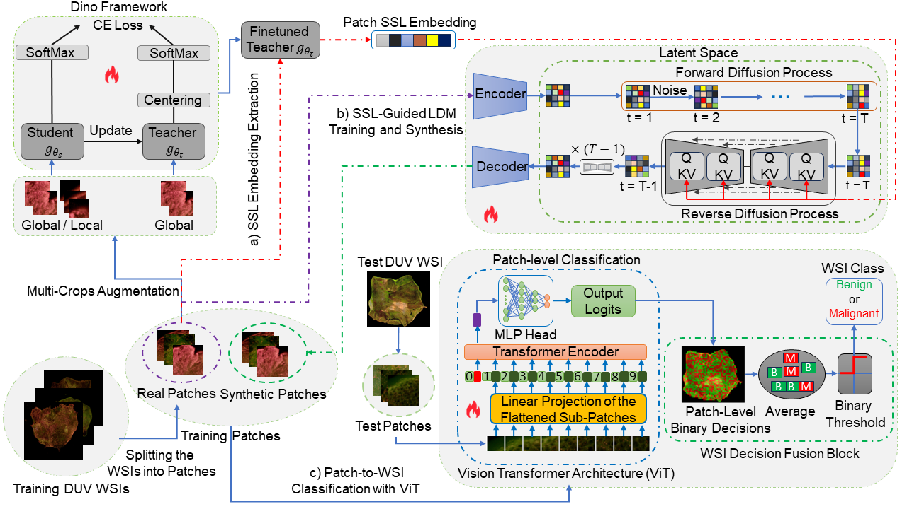
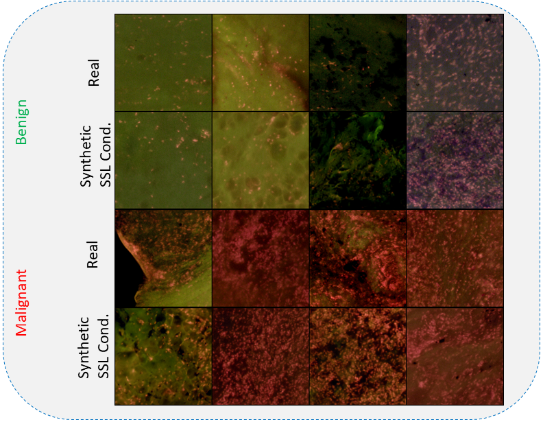
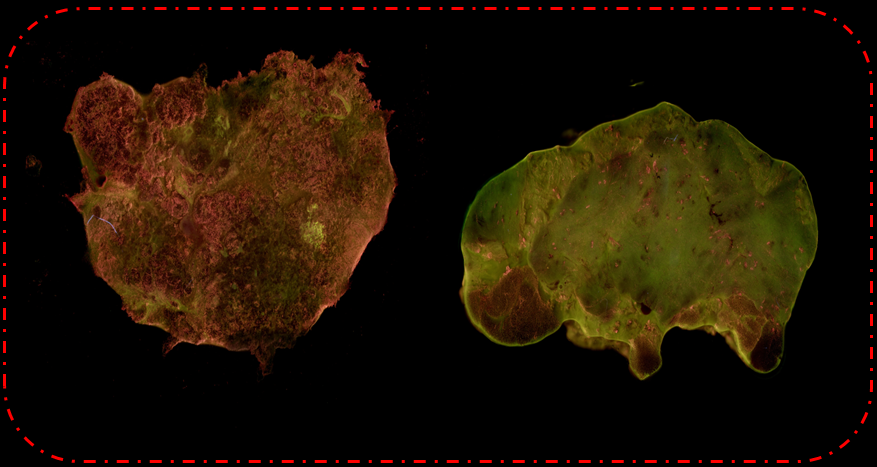
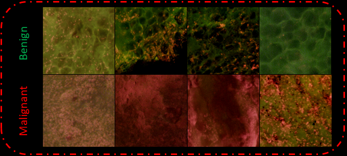

# Self-Learned Representation-Guided Latent Diffusion Model for Breast Cancer Classification in Deep Ultraviolet Whole Surface Images

Official implementation of the paper:

**"Self-Learned Representation-Guided Latent Diffusion Model for Breast Cancer Classification in Deep Ultraviolet Whole Surface Images"**

📄 Paper: [Link to Paper](https://www.researchgate.net/publication/399875627_Self-learned_representation-guided_latent_diffusion_model_for_breast_cancer_classification_in_deep_ultraviolet_whole_surface_images)

## Authors
Pouya Afshin, David Helminiak, Tianling Niu, Julie M. Jorns, Tina Yen, Bing Yu, Dong Hye Ye

Georgia State University, Marquette University, Medical College of Wisconsin

---

## Overview

Breast-Conserving Surgery (BCS) requires precise intraoperative margin assessment to preserve healthy tissue. Deep Ultraviolet Fluorescence Scanning Microscopy (DUV-FSM) offers rapid, high-resolution surface imaging for this purpose; however, the scarcity of annotated DUV data hinders the training of robust deep learning models.  

To address this, we propose a **Self-Supervised Learning (SSL)-guided Latent Diffusion Model (LDM)** to generate high-quality synthetic training patches. By guiding the LDM with embeddings from a fine-tuned DINO teacher, we inject rich semantic details of cellular structures into the synthetic data. We combine real and synthetic patches to fine-tune a Vision Transformer (ViT), using patch-prediction aggregation for WSI-level classification.  

Experiments using 5-fold cross-validation demonstrate that our method achieves **96.47% accuracy** and reduces the **FID score to 45.72**, significantly outperforming class-conditioned baselines.

> **Conference Acceptance:** This paper has been accepted for the **IEEE International Symposium on Biomedical Imaging (ISBI) 2026 (https://biomedicalimaging.org/2026/)**, London, UK, and will be presented in the corresponding session.
---

## Method Overview



Pipeline:

1. Extract self-supervised features using DINO
2. Guide latent diffusion model with semantic embeddings
3. Generate synthetic DUV patches
4. Train Vision Transformer classifier using real + synthetic data
5. Evaluate the finetuned model on the patches of the DUV WSI Test sample
6. Aggregate patch predictions to classify the test DUV WSI 
---
## Comparison of Real vs SSL-Guided Synthetic Patches



Based on the results, the synthetic patches **capture realistic fine-grained morphological details** present in the real patches, including structures characteristic of **benign and cancerous tissues**. This demonstrates that the SSL-guided LDM effectively preserves important cellular and tissue-level features in the generated data.

## SSL Embeddings & Synthetic Data Generation

The SSL embeddings and synthetic patch generation were obtained by following these steps:

1. **Self-Supervised Feature Extraction with DINO**  
   Fine-tune the dataset using the **DINO framework** from [facebookresearch/dino](https://github.com/facebookresearch/dino) with the parameters described in the paper.  
   After finetuning, use the teacher network to **extract embeddings for each patch**.

2. **Latent Diffusion Model (LDM) Pretraining**  
   Follow the official instructions from the LDM repository [https://github.com/CompVis/latent-diffusion]to obtain **pretrained models** and guidance for training and evaluating the LDM and VAE.

3. **Variational Autoencoder (VAE)**  
   Use the recommended VAE from [cvlab-stonybrook/PathLDM](https://github.com/cvlab-stonybrook/PathLDM) to encode the patch representations.

4. **Training and Synthetic Patch Generation**  
   Follow [cvlab-stonybrook/Large-Image-Diffusion](https://github.com/cvlab-stonybrook/Large-Image-Diffusion) for using the embeddings to train the LDM and generate synthetic DUV patches.


## Installation & Requirements

Clone the repository:

git clone https://github.com/pouya12/ssl-guided-ldm-duv-breast-cancer.git
cd ssl-guided-ldm-duv-breast-cancer

Install required dependencies:

pip install -r requirements.txt

---

## Dataset

The dataset includes **142 DUV WSIs** (58 benign, 84 malignant) collected from the **Medical College of Wisconsin**. 



A total of **172,984 non-overlapping 400×400 patches** were extracted:
- 48,619 malignant patches  
- 124,365 benign patches
- 


Patch labels were obtained from pathologist annotations.

> **Note:  Researchers interested in accessing the dataset may contact the Medical College of Wisconsin  and Marquette University for potential collaboration or data sharing.
---
## Acknowledgements

The Vision Transformer (ViT) implementation used in this repository is adapted from the following open-source project:

https://github.com/jeonsworld/ViT-pytorch

The original implementation was modified to support loading pretrained models trained on large-scale public datasets and to integrate them into our training pipeline for DUV-FSM breast cancer classification.
---
## Citation

If you find this work useful, please cite:

```bibtex
@misc{afshin2026selflearnedrepresentationguidedlatentdiffusion,
      title={Self-learned representation-guided latent diffusion model for breast cancer classification in deep ultraviolet whole surface images}, 
      author={Pouya Afshin and David Helminiak and Tianling Niu and Julie M. Jorns and Tina Yen and Bing Yu and Dong Hye Ye},
      year={2026},
      eprint={2601.10917},
      archivePrefix={arXiv},
      primaryClass={cs.CV},
      url={https://arxiv.org/abs/2601.10917}, 
}
